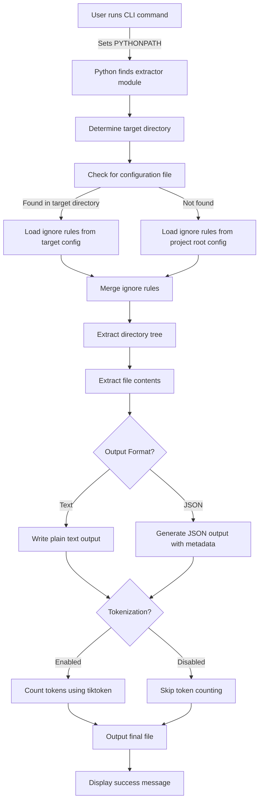

# Architecture Overview

This document provides a high-level overview of how **LLMify-Code** works internally. The tool is designed to extract a codebase, apply ignore rules from a YAML configuration file (with fallback options), and generate output in various formats (plain text or JSON). Additionally, it can optionally count tokens using tiktoken to manage input sizes for large language models.

## High-Level Workflow

## Key Components

- **Configuration Loader:**  
  Determines which YAML configuration file to use by first checking the target directory, and if not found there, falling back to the one in the project root. This allows external projects to either have their own configuration or rely on a central configuration file.

- **Ignore Rule Merger:**  
  Converts lists of ignored directories and files from the YAML file into sets for efficient filtering.

- **Directory Tree Generator:**  
  Recursively scans the target directory while applying ignore rules to generate a formatted textual representation of the directory structure.

- **File Extractor:**  
  Reads file contents (with error handling for encoding issues using `errors="replace"`) and writes them to the output file.

- **Output Format Decision:**  
  Based on the user’s input (`--output-format`), the tool either writes a plain text file (with the directory tree and file contents) or generates a JSON file that includes the directory tree, individual file metadata, and token counts.

- **Token Counter:**  
  Optionally counts tokens using tiktoken (if the `--tokenize` flag is set) to help manage the size of the output when used as input for large language models.

- **User Interaction & Logging:**  
  The CLI prompts the user for confirmation before proceeding, and uses Rich to display informative log messages throughout the process.

This modular design ensures that **LLMify-Code** remains flexible, maintainable, and easily extendable as the project grows.
